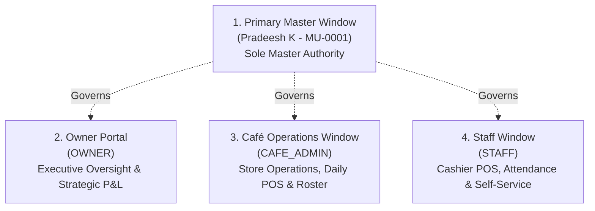

# Zamorin Café ERP — Current State & Change Register

**Document Version:** 2.0.1  
**Generated:** 2026-10-02  
**Baseline Repository:** `zamorinestate/estate-erp`  
**Active Branch:** `ui/clean-navigation-v1`  
**Verified Implementation SHA:** `44309b243e2342f75648cef702cd6460a8c9424f` (final export-policy remediation baseline); **Live PR Head:** query PR #35 at review/merge time rather than self-pinning this documentation commit.  
**Release Governance Status:** Software Verification Pass; Commercial Cutover Gated by EXT-19 & Physical Hardware Gate REC-04E  

---

## A. Executive Summary

Zamorin Café ERP is an enterprise management, POS, inventory, workforce, attendance, statutory, and corporate governance platform purpose-built for multi-outlet café and restaurant operations.

The application has completed comprehensive architectural, operational, and security hardening:
1. **Permanent 4-Window Topology:** Non-primary Normal Master is completely abolished. System authority operates strictly across four canonical windows: Primary Master (`MASTER` with `isPrimaryMaster: true`), Owner Portal (`OWNER`), Café Operations (`CAFE_ADMIN`), and Employee Self-Service / Cashier (`STAFF`).
2. **Clean Navigation & Parent-Workspace Consolidation:** Primary Master first-level navigation is streamlined to exactly 19 destinations; Owner navigation is streamlined to exactly 17 destinations. Secondary operational tools (customers, bills, passbook, departmental orders, assets, quality, mail operations, system health) are consolidated into their logical parent workspaces while remaining accessible via authorized deep links.
3. **Export Centre — PDF + XLSX Exclusively:** The Export Centre has been standardized strictly to authentic PDF and OpenXML XLSX (.xlsx) workbooks with formula-injection neutralization (`'`, `+`, `-`, `=`, `@` neutralization in shared strings). User-facing CSV has been eliminated across all operational export actions.
4. **Authoritative POS Menu Pipeline:** Resolved the production defect where POS displayed no sale items. Implemented a canonical café-scoped POS catalog pipeline (`GET /api/v1/pos/catalog/:cafeId`) linking `MenuItem` master definitions to `OutletOffering` café assignments, pricing overrides, POS channel eligibility, and dynamic frontend caching in [posTill.js](frontend/src/js/pages/posTill.js).
5. **Robust Attendance & Evidence Retention:** Hardened rotating cryptographic QR challenge generation, GPS geofencing, selfie photo capture, and private document storage. Committed attendance evidence is permanently protected against orphan purges through a non-destructive administrative review model.

All 644 backend regression tests pass, all 730 frontend JavaScript modules parse without error, 36/36 system verification gates pass, and committed secret scanning detects 0 credentials.

---

## B. Current Canonical Repository

- **Canonical GitHub Repository:** `https://github.com/zamorinestate/estate-erp` (Organization: `zamorinestate`, Repository: `estate-erp`).
- **Legacy Namespace Notice:** `zamorinestate-erp/estate-erp` is a GitHub redirect. The canonical repository and GitHub Actions use `zamorinestate/estate-erp`; both Render services still require an operational repository rebind from the legacy namespace.
- **Default Production Branch:** `main` (Latest commit: `a3b3bd1f6171bb4cd501970e8d7c7ed083a87e2c` — *Merge PR #34: make Atlas helper fail closed in production*).
- **Active Working Branch:** `ui/clean-navigation-v1` (PR #35).
- **Verified Implementation SHA:** `44309b243e2342f75648cef702cd6460a8c9424f`. The live PR head must be read directly from PR #35 because documentation-only commits can advance the branch without changing the verified software implementation.
- **Status of Active Pull Requests:**
  - **PR #35 (`ui/clean-navigation-v1`):** Open. Contains clean navigation architecture, parent-workspace consolidation, Export Centre workspace, stored-XSS mitigations, universal OpenXML XLSX engine, elimination of user-facing CSV, and the canonical POS menu pipeline fix.
  - **PR #16 (`hardware-acceptance`):** DRAFT / DO NOT MERGE WHOLESALE. Historical diverged branch. Software hardening was extracted into separate PRs. Hardware gate REC-04E remains pending real physical thermal printer hardware.

---

## C. Change Register

| ID | Area / Requirement | Status | Implementation Location | Files Involved | Verification Tests |
|---|---|---|---|---|---|
| **CR-01** | **Normal Master Retirement** | COMPLETE_ON_MAIN | Backend middleware, auth service, frontend router | [authenticate.js](backend/src/middleware/authenticate.js), [authService.js](backend/src/services/authService.js), [navigation.js](frontend/src/js/navigation.js) | `normalMasterRetirementRegression.test.js`, `cleanNavigationSuite.test.js` |
| **CR-02** | **Clean Navigation Architecture** | COMPLETE_IN_OPEN_PR (PR #35) | Navigation configuration & app shell | [navigation.js](frontend/src/js/navigation.js), [app.js](frontend/src/js/app.js) | `cleanNavigationSuite.test.js` (NAV-001–003) |
| **CR-03** | **Parent-Workspace Consolidation** | COMPLETE_IN_OPEN_PR (PR #35) | Parent workspace hubs & route allowance | [navigation.js](frontend/src/js/navigation.js), [router.js](frontend/src/js/router.js) | `cleanNavigationSuite.test.js` (NAV-005–007) |
| **CR-04** | **Export Centre: PDF + XLSX Only** | COMPLETE_IN_OPEN_PR (PR #35) | Export controllers, generator utilities, catalogue | [exportCentre.js](frontend/src/js/pages/exportCentre.js), [openXmlExport.js](frontend/src/js/utils/openXmlExport.js), [reportsExportController.js](backend/src/reporting/controllers/reportsExportController.js) | `exportDataIntegritySuite.test.js` (EXP-001–012) |
| **CR-05** | **Export History Stored-XSS Mitigation** | COMPLETE_IN_OPEN_PR (PR #35) | Export history DOM renderer | [exportCentre.js](frontend/src/js/pages/exportCentre.js) | `exportHistoryXssSuite.test.js` |
| **CR-06** | **Elimination of User-Facing CSV** | COMPLETE_IN_OPEN_PR (PR #35) | Contextual export buttons across 28 frontend pages | Attendance, Leave, Inventory, Payroll, Assets, Menu, Loans, Bills, Vendors | `exportDataIntegritySuite.test.js` (EXP-011) |
| **CR-07** | **POS Menu / Sale Items Pipeline (§28)** | COMPLETE_IN_OPEN_PR (PR #35) | Backend POS controller & frontend POS till | [posController.js](backend/src/controllers/posController.js), [posRoutes.js](backend/src/routes/posRoutes.js), [posTill.js](frontend/src/js/pages/posTill.js) | `posCatalogPipeline.test.js` (POS-CAT-01–04) |
| **CR-08** | **Café Administration Action Wiring (§22)** | COMPLETE_ON_MAIN | Administration table delegation & address formatter | [administration.js](frontend/src/js/pages/administration.js), [addressFormatter.js](frontend/src/js/utils/addressFormatter.js) | `cafeAdministrationActionsWiring.test.js` (TC-1–13) |
| **CR-09** | **Attendance QR + Geo + Selfie Verification** | COMPLETE_ON_MAIN | Attendance controllers, geofence utils, scanner | [attendanceController.js](backend/src/modules/attendance/attendanceController.js), [attendanceQrScannerPage.js](frontend/src/js/pages/attendanceQrScannerPage.js) | `attendanceSecurePresence.test.js`, `p0AttendanceRemediation.test.js` |
| **CR-10** | **Attendance Evidence Retention & Non-Destructive Purge** | COMPLETE_ON_MAIN | Document reconciliation service | [documentReconciliationService.js](backend/src/services/documentReconciliationService.js) | `documentStorageDurability.test.js` |
| **CR-11** | **Server-Authoritative POS Settlement** | COMPLETE_ON_MAIN | POS order service & bill model | [posOrderService.js](backend/src/services/posOrderService.js), [Bill.js](backend/src/models/Bill.js) | `posBillingTerminal.test.js`, `posOfflineFinancialSafety.test.js` |
| **CR-12** | **Fail-Closed Production Bootstrap & Secrets** | COMPLETE_ON_MAIN | Config loaders & database connection scripts | [db.js](backend/src/config/db.js), [startAtlasServer.js](backend/src/scripts/startAtlasServer.js) | `bootstrapSecretFallbacks.test.js`, `startAtlasServerSafety.test.js` |
| **CR-13** | **Vendor Procurement & Order Verification Freeze** | COMPLETE_ON_MAIN | Procurement controllers, GRN verification, StockMovement | [vendorOrderLifecycle.js](backend/src/controllers/vendorOrderLifecycle.js) | `e2e_vendor_freeze_gate.mjs`, `rec17VendorAccountsPayableLedger.test.js` |

---

## D. Role Architecture

The ERP operates strictly across **4 dedicated windows**:

### Role Invariants
1. **Primary Master:**
   - Identity: `MU-0001` (`pradeeshk331@gmail.com`).
   - Database model: `role = 'MASTER'` and `isPrimaryMaster = true`.
   - Sole authority for organization-wide configuration, period closing, audit review, and Master approvals.
2. **Normal Master Retirement:**
   - The operational "Normal Master" persona is permanently retired.
   - Any session or login where `role === 'MASTER' && isPrimaryMaster !== true` is rejected with `401 MASTER_ACCOUNT_RETIRED`.
   - Onboarding and employee management support only `STAFF`, `CAFE_ADMIN`, and `OWNER`.
3. **Owner Portal (`OWNER`):**
   - Read-only executive financial reporting, multi-outlet benchmarking, corporate governance, risk registers, and CAPEX planning.
4. **Café Operations (`CAFE_ADMIN`):**
   - Single-outlet operations: store till open/close, inventory stock takes, roster scheduling, staff shift supervision, and GRN delivery receiving.
5. **Staff Window (`STAFF`):**
   - Cashier till operations, attendance clock-in/out via QR+geo+selfie, self-service leaves, advance requests, and payslip viewing.

---

## E. Navigation Architecture

### Primary Master Sidebar (Exactly 19 First-Level Destinations)
1. Dashboard (`#dashboard`)
2. POS & Billing Terminal (`#pos-till`)
3. Sales & Cash Book (`#cash-book`)
4. Expense Management (`#expenses`)
5. Inventory Management (`#inventory`)
6. Vendors & Purchasing (`#vendors`)
7. Procurement & POs (`#procurement`)
8. Menu Management (`#menu-management`)
9. Tasks & Approvals (`#tasks-approvals`)
10. Revenue Share & Outlets (`#revenue-share`)
11. Personal Ledger (`#personal-ledger`)
12. Workforce Directory (`#employees`)
13. Attendance & Shifts (`#attendance-shifts`)
14. Payroll Engine (`#payroll-management`)
15. Reports & Business Intelligence (`#reports-analytics`)
16. Export Centre (`#export-centre`)
17. Notification Centre (`#notifications`)
18. Financial Accounts (`#finance-accounts`)
19. Administration & Settings (`#administration`)

### Owner Sidebar (Exactly 17 First-Level Destinations)
1. Executive Dashboard (`#owner-dashboard`)
2. Outlets & Performance (`#owner-cafe-performance`)
3. Financial Summary (`#owner-finance-summary`)
4. Inventory Oversight (`#owner-inventory`)
5. Procurement Intelligence (`#owner-procurement`)
6. Menu & Pricing Strategy (`#owner-menu`)
7. Task Oversight (`#owner-tasks`)
8. Revenue Share & Outlets (`#revenue-share`)
9. Personal Ledger (`#personal-ledger`)
10. Workforce Overview (`#owner-employees`)
11. Attendance Monitoring (`#owner-attendance`)
12. Payroll Review (`#owner-payroll`)
13. Reports & Analytics (`#reports-analytics`)
14. Export Centre (`#export-centre`)
15. Notification Centre (`#notifications`)
16. Financial Accounts (`#owner-finance-accounts`)
17. Corporate Governance (`#owner-governance`)

*4 Permanently Locked Shared Destinations:* **Personal Ledger**, **Revenue Share & Outlets**, **Reports**, **Export Centre**.

---

## F. Authentication and Security

- **Login 2.0:** Hardened multi-factor authentication engine with passkeys (WebAuthn), device fingerprinting, and account lockout throttling.
- **Fail-Closed Credentials:** Absence of MongoDB URI, JWT secrets, or MFA salt immediately halts the server in production. Zero hardcoded secrets in source code.
- **Trusted Device Binding:** Café terminal hardware contexts are strictly bound using cryptographically verified device identifiers.
- **Tenant & Café Isolation:** Every backend query checks `organisationId` and `cafeId`. Requests attempting cross-café mutations or reads return `403 CROSS_CAFE_RESOURCE_DENIED`.

---

## G. POS Pipeline & Operations

- **Menu/Product Pipeline (§28 Fix):**
  - Backend: `GET /api/v1/pos/catalog/:cafeId` verifies café access, fetches active `MenuItem` records for concept `CAFE` / `SHARED`, queries `OutletOffering` for café enablement, channel eligibility, and local price overrides, maps categories to POS display buckets (`Hot Coffees`, `Cold Brews`, `Bakery & Viennoiserie`, `Savouries & Mains`, `Desserts`), and returns authoritative prices.
  - Frontend: [posTill.js](frontend/src/js/pages/posTill.js) dynamically fetches this catalog into `_menuCatalogue` upon mount and café-switch, caches the catalog in `localStorage`, and cleanly updates the view.
  - Empty State: Renders a clear operational prompt if no items are configured.
- **Server-Authoritative Settlement:** Client totals are treated as advisory. The backend derives line item totals, GST splits (CGST/SGST/IGST), discount deductions, and final payable paisa.
- **Register Sessions:** Each till operates in an isolated register session with cash drawer tracking and daily Z-Report reconciliations.
- **Offline Review & Recovery:** Offline sales queued in IndexedDB (`ZamorinOfflineDB_v2`) replay idempotently via `/pos/offline-sync`. Suspicious or conflicted offline entries route to pending offline review, accessible solely to Primary Master and authorized Café Admin.

---

## H. Attendance & Evidence Retention

- **Entry Flow:** Employee scans café QR -> Opaque challenge verified -> Session validated -> Geolocation verified against café geofence coordinates -> Camera captures selfie evidence -> Attendance punch recorded.
- **Independent Events:** Clock-in and clock-out require distinct selfie evidence files and independent timestamp records.
- **Calendar & History:** Authorized actors view attendance history showing clock-in/out times, geofence compliance, and evidence images streamed via governed endpoints.
- **Non-Destructive Retention:** Evidence images uploaded to GridFS/private document storage are never erased by automatic timers. The orphan reconciliation service reports unlinked items for audited administrative review, ensuring valid committed evidence is never lost.

---

## I. Export Centre (PDF + XLSX Exclusively)

The Export Centre operates under a strict format policy: **PDF and OpenXML XLSX (.xlsx) only.** CSV is completely eliminated from the user-facing interface.

### Backed Canonical Report Catalogue (18 Verified Reports)

| Report ID | Title | Domain | Formats | Backend Route / Data Source |
|---|---|---|---|---|
| `REP-SALES-SUMMARY` | Daily Sales & Reconciliation Summary | Sales | PDF, XLSX | `GET /api/v1/reports/sales-summary` |
| `REP-HOURLY-SALES` | Hourly Sales & Peak Hour Velocity | Sales | PDF, XLSX | `GET /api/v1/reports/hourly-sales` |
| `REP-CATEGORY-MIX` | Category & Product Performance Mix | Sales | PDF, XLSX | `GET /api/v1/reports/category-mix` |
| `REP-DISCOUNTS-VOIDS`| Discounts, Voids & Comps Audit | Sales | PDF, XLSX | `GET /api/v1/reports/discounts-voids` |
| `REP-INVENTORY-VALUATION` | Stock Valuation & Balance Report | Inventory | PDF, XLSX | `GET /api/v1/reports/inventory-valuation` |
| `REP-STOCK-MOVEMENTS`| Stock Movement & Wastage Audit | Inventory | PDF, XLSX | `GET /api/v1/reports/stock-movements` |
| `REP-REORDER-STATUS` | Low Stock & Reorder Alert Register | Inventory | PDF, XLSX | `GET /api/v1/reports/reorder-status` |
| `REP-PO-LIFECYCLE` | Purchase Order & Vendor Fulfilment | Procurement | PDF, XLSX | `GET /api/v1/reports/po-lifecycle` |
| `REP-VENDOR-LEDGER` | Vendor Outstanding & Payment Aging | Procurement | PDF, XLSX | `GET /api/v1/reports/vendor-ledger` |
| `REP-FINANCIAL-PL` | Profit & Loss Operating Statement | Finance | PDF, XLSX | `GET /api/v1/reports/financial-pl` |
| `REP-TAX-GSTR1` | GST Outward Supplies (GSTR-1 Ready) | Finance | PDF, XLSX | `GET /api/v1/reports/tax-gstr1` |
| `REP-DAY-CLOSE` | Day-End Register & Drawer Settlement | Finance | PDF, XLSX | `GET /api/v1/reports/day-close` |
| `REP-ATTENDANCE-SUMMARY` | Staff Attendance & Shift Compliance | Workforce | PDF, XLSX | `GET /api/v1/reports/attendance-summary` |
| `REP-PAYROLL-REGISTER`| Monthly Compensation & Deduction Register | Workforce | PDF, XLSX | `GET /api/v1/reports/payroll-register` |
| `REP-STATUTORY-COMPLIANCE` | EPF, ESI & Professional Tax Summary | Workforce | PDF, XLSX | `GET /api/v1/reports/statutory-compliance` |
| `REP-CUSTOMER-LOYALTY` | Customer Visits & Loyalty Redemption | Customer | PDF, XLSX | `GET /api/v1/reports/customer-loyalty` |
| `REP-PERSONAL-LEDGER` | Master Personal Ledger & Drawing Account | Executive | PDF, XLSX | `GET /api/v1/personal-ledger/export` |
| `REP-PASSBOOK-TREASURY` | Treasury Passbook & Account Movements | Executive | PDF, XLSX | `GET /api/v1/passbook/export` |

---

## J. Infrastructure Topology

- **GitHub:** `https://github.com/zamorinestate/estate-erp` (Public repository; 0 committed secrets).
- **MongoDB Atlas:** Cluster `zamorin-cluster` in AWS `AP_SOUTH_1` (Mumbai). MongoDB 8.0.x on Free Tier. Isolated runtime users for staging and production databases. IP access restricted.
- **Render Production Service:** `zamorin-cafe-erp-backend` (Region: Singapore, Root: `backend`, Branch: `main`).
- **Render Staging Service:** `zamorin-cafe-erp-staging` (Region: Singapore, Root: `backend`, Branch: `main`).
  - *Infrastructure Finding:* Render dashboard settings currently list repository as `https://github.com/zamorinestate-erp/estate-erp`. A manual rebind in Render to `zamorinestate/estate-erp` is documented for operational execution.
- **Vercel:** No authorized Vercel team/project is exposed by the connected Vercel session at this audit point. The repository intentionally has no hardcoded `.vercel/project.json` dependency; do not infer or fabricate a live Vercel project binding.

---

## K. CI & Verification Test Accounting

Canonical software verification was independently audited on implementation SHA `44309b243e2342f75648cef702cd6460a8c9424f`. PR #35 must additionally have all required GitHub Actions green on its live head/merge ref immediately before merge; documentation-only commits do not waive exact-head CI.

| Verification Suite | Checks Executed | Passed | Failed | Duration |
|---|---|---|---|---|
| **Backend Test Suite (`npm test`)** | 644 | 644 | 0 | 84.8s |
| **POS Catalog Pipeline Suite (`posCatalogPipeline.test.js`)** | 5 | 5 | 0 | 1.5s |
| **Clean Navigation Suite (`cleanNavigationSuite.test.js`)** | 11 | 11 | 0 | 0.05s |
| **Export Integrity Suite (`exportDataIntegritySuite.test.js`)** | 12 | 12 | 0 | 0.35s |
| **Export History XSS Suite (`exportHistoryXssSuite.test.js`)** | 6 | 6 | 0 | 0.04s |
| **Personal Ledger Integration (`pm05PersonalLedgerIntegration.test.js`)** | 6 | 6 | 0 | 4.2s |
| **Café Admin Wiring Suite (`cafeAdministrationActionsWiring.test.js`)** | 13 | 13 | 0 | 0.09s |
| **Attendance Security Suites (5 suites)** | 78 | 78 | 0 | 21.4s |
| **Frontend Router & ES Module Imports (`verifyRouterImports.mjs`)** | 88 modules | 88 | 0 | 0.8s |
| **Frontend JS Syntax Verification (`verify_all.js`)** | 730 files | 730 | 0 | 1.2s |
| **Backend JS Syntax Verification (`check_syntax.mjs`)** | 606 files | 606 | 0 | 4.5s |
| **Committed Secret Scanner (`scan_secrets.mjs`)** | Workspace | 0 secrets | 0 | 0.6s |
| **Master System Verification (`master_system_verification.mjs`)** | 36 checks | 36 | 0 | 28.0s |

---

## L. Remaining Blockers & Next Actions

1. **Hardware Blocker — REC-04E Real Thermal Printer Certification:**
   - Requires physical hardware testing with ESC/POS thermal printers on-site. Software bridges and device attestation protocols remain complete and preserved.
2. **Infrastructure Action — Render Repository Rebind:**
   - Both Render services depend on GitHub's repository redirect.
   - Recommended procedure: In Render Web Dashboard -> Settings -> General -> Git Repository, update repository URL from `https://github.com/zamorinestate-erp/estate-erp` to `https://github.com/zamorinestate/estate-erp`. Do not recreate services or modify environment variables.
3. **PR Merge Governance:**
   - Merge PR #35 (`ui/clean-navigation-v1`) into `main` after review.

---

## M. Deleted & Retired Functionality

- **Non-primary Normal Master Persona/Authority:** Permanently retired across authentication, authorization, routes, navigation, and frontend UI. The canonical `MASTER` model remains valid only for Primary Master when `isPrimaryMaster === true`.
- **Export Centre CSV Format:** Completely removed from user-facing UI, catalogues, dropdowns, and download endpoints.
- **Developer Badges & Stage Chips:** Engineering labels (`STAGE xx`, `OWN-SCR-xxx`, internal badges) removed from production views.
- **Hardcoded Secret Fallbacks:** Predictable bootstrap secrets permanently purged.
- **Tracked Vercel Project Binding:** Artifact file `.vercel/project.json` removed from version control.

---

## N. Regression Protection

Automated test suites continuously prevent retired behaviors from returning:
- `cleanNavigationSuite.test.js` enforces exact 19/17 menu items and verifies that Normal Master remains rejected.
- `exportDataIntegritySuite.test.js` (EXP-011) scans all frontend source files to guarantee zero user-facing CSV downloads while preserving legitimate operational CSV statement imports.
- `posCatalogPipeline.test.js` verifies that POS menu items dynamically load with correct pricing and tenant/café isolation.
- `scan_secrets.mjs` prevents credential commits to Git.
- `master_system_verification.mjs` runs 36 system gates across all 28 business modules prior to release.
