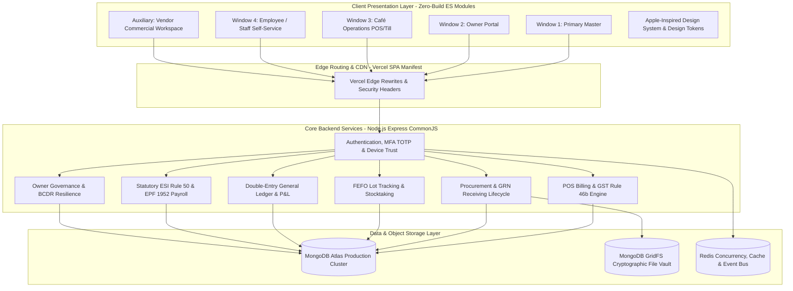

# ZAMORIN CAFÉ ERP — COMPLETE WINDOWS & FUNCTIONAL ARCHITECTURE SPECIFICATION

**Document Version**: 2.0.0 (Authoritative)  
**System Name**: Zamorin Café ERP  
**Organization**: Zamorin Estate Pvt. Ltd.  
**Repository**: `zamorinestate/estate-erp`  
**Classification**: Enterprise Core Architecture & Operational Manual  
**Last Updated**: October 2026

---

## 1. Executive System Overview & Architecture

**Zamorin Café ERP** is an enterprise-grade multi-location food and beverage ERP system purpose-built for chain cafés, roasteries, and multi-franchise store networks.



### Architectural Principles
- **Zero-Build Vanilla JS Frontend**: The client operates purely via native browser ES Modules, eliminating compilation latency, bundling fragility, and client hydrate mismatches.
- **Node.js Express Modular Monolith**: Backend controllers maintain strict domain encapsulation, idempotency guards, and centralized error handling.
- **MongoDB Atlas & GridFS Document Vault**: Financial vouchers, inventory batches, and statutory records are stored in MongoDB Atlas, with vendor delivery receipts and bills cryptographically persisted in GridFS.
- **Redis Concurrency & Rate Limiting**: Distributed locks guard GST invoice numbering, concurrent logins, and distributed session states.
- **Apple-Inspired Design System**: Built with Apple Human Interface Principles, featuring translucent materials, OLED black dark mode (`#000000`), Apple Blue interaction accent (`#007aff`), high-contrast SF-style typography, 44px+ touch targets, and responsive bottom sheets on mobile devices.

---

## 2. The Permanent 4-Window Topology & Normal Master Abolition

By explicit user mandate and core repository governance rules ([`AGENTS.md`](file:///d:/Zamorin_Cafe_ERP_Build/AGENTS.md)), the ERP operates with **strictly 4 dedicated operational windows**. The legacy "Normal Master" persona has been **permanently abolished**:

```
+---------------------------------------------------------------------------------------------------+
|                                  THE 4 CANONICAL ERP WINDOWS                                      |
+---------------------------------------------------------------------------------------------------+
| 1. PRIMARY MASTER WINDOW     | Sole system governor (Pradeesh K / MU-0001). Full control.        |
| 2. OWNER PORTAL WINDOW       | Strategic executive oversight, P&L, CAPEX, risk, and governance.  |
| 3. CAFÉ OPERATIONS WINDOW    | High-velocity store floor POS, inventory count, deliveries, till.  |
| 4. EMPLOYEE / STAFF WINDOW   | Self-service shift attendance, payslips, leaves, loan requests.   |
+---------------------------------------------------------------------------------------------------+
| * AUXILIARY SUPPLIER PORTAL  | Dedicated external read-only workspace for contracted vendors.     |
+---------------------------------------------------------------------------------------------------+
```

---

## 3. Window 1: Primary Master Window

### A. Role Definition & Access Scope
- **Canonical Role**: `MASTER` where `isPrimaryMaster === true`.
- **Sole Account**: Held exclusively by **Pradeesh K** (`MU-0001` / `pradeeshk331@gmail.com`).
- **Access Boundary**: Unrestricted governance across all café outlets, financial accounts, statutory payroll, personal ledgers, system administration, and infrastructure telemetry.

### B. Detailed Screen & Functional Breakdown

#### 1. Command Centre Dashboard (`#dashboard`)
The multi-location operational command bridge for the entire café chain:
- **Global Portfolio Status Strip**: Real-time IST business date/time clock, active floor staff count across all branches, live order stream velocity, and database sync health.
- **Portfolio Pulse KPI Grid**:
  - *Gross Sales Total*: Formula: $\sum(\text{Paid Bill Subtotals} + \text{Taxes} - \text{Discounts})$. Includes comparison with prior periods.
  - *Total Orders Completed*: Live bill count.
  - *Average Order Value (AOV)*: Real-time mathematical quotient ($\text{Gross Sales} \div \text{Completed Bills}$).
  - *Operating Expenses*: Live posted expenses across all branches.
  - *Active Floor Staff*: On-duty clock-ins vs scheduled roster.
  - *Attendance Exceptions*: Unexcused absences, missed punches, and anomalies.
  - *Inventory Stock Risk*: SKUs at zero stock (Critical) or below Par.
  - *Open Action Items*: Pending purchase orders, leave requests, and maintenance alerts.
- **4 Dashboard Navigation Pages**:
  - *Page 1: Executive Essentials*: Core KPIs, fast action workflow buttons (New POS Bill, Record Expense, Adjust Stock, Onboard Employee, Dept Order, Personal Ledger, Financial Reports, UI Suite).
  - *Page 2: Branch Operations*: Outlet-by-outlet comparison grid, individual café health badges, target pace indicators.
  - *Page 3: Revenue & Trends*: Dual-series revenue and margin visualizer with a toggle between graphical SVG charts and raw tabular data.
  - *Page 4: Workforce & Audit*: Shift exception summaries, labor cost percentage, and live audit highlights.
- **Needs Your Attention Queue**: Real-time exception feed sorted by severity (`CRITICAL`, `HIGH`, `MEDIUM`, `LOW`) with one-click routing to the offending module.

#### 2. POS & Billing Terminal (`#pos`)
Direct access to the point-of-sale engine with full administrative privileges:
- Multi-outlet switcher to inspect or operate any branch's till.
- Full bill management, price override authorizations, void/refund approvals, and Z-Report closing audits.

#### 3. Global & Branch Inventory Management (`#inventory`)
Complete materials and stock lifecycle across the enterprise:
- **Subtabs**:
  - `Overview`: Live stock valuation in Rupee (`₹`), critical low-stock alerts, out-of-stock SKU counts.
  - `Stock Levels`: Outlet-filtered inventory table showing SKU, Item Name, Category, UOM, Current On-Hand, Par Level, Reorder Point, and Unit Cost.
  - `Movements`: Immutable ledger of every stock ingress, egress, depletion, wastage, and inter-branch transfer.
  - `Batches & Lots (FEFO)`: First-Expiry-First-Out batch tracking with manufacturing date, expiry date, supplier lot number, and shelf-life warning tags.
  - `Stocktaking & Audits`: Physical stock count sheets, variance calculations (Book Stock vs Physical Stock), shrinkage percentages, and stock adjustment approvals.
  - `Wastage & Spoilage`: Logging damaged, expired, or dropped goods with mandatory reason codes and cost write-offs.

#### 4. Procurement & Purchase Orders (`#procurement`)
Governed by the **Permanent Procurement Lifecycle Freeze**:
- **Subtabs**:
  - `Overview`: Procurement spend metrics, pending deliveries count, outstanding GRN approvals.
  - `Orders List`: Complete purchase orders table filterable by status (`DRAFT`, `SUBMITTED`, `APPROVED`, `ORDERED`, `RECEIVED`, `CANCELLED`).
  - `Order Verification Inbox`: Arriving delivery inspection queue showing physical count shortages and mandatory discrepancy reasons.
  - `Guided Buying Catalogue`: Approved item master with contracted vendor pricing, MOQs, pack sizes, and lead times.
- **Key Master Actions**:
  - **Review & Approve Order Requests**: Master reviews cashier-submitted order requests (Same Day / Next Day).
  - **GRN Audit & Vendor Bill Download**: Inspects staff delivery physical count, views shortages/discrepancies, and clicks `📥 Download Vendor Bill for Accounts` to retrieve the PDF/JPEG bill uploaded by staff.
  - **Master Approval / Revocation**: One-click Master approval. Any subsequent modification by staff immediately revokes Master approval and triggers a mandatory re-approval workflow.

#### 5. Vendors & Supplier Management (`#vendors`)
- Directory of all registered suppliers with GSTIN, PAN, FSSAI licenses, payment terms, and bank details.
- Vendor performance scorecards (on-time delivery rate, fill rate, quality rejection rate).
- Contracted Item Mapping: Assigning approved items to vendors with contracted rates and minimum order quantities.

#### 6. Action Centre & Approvals (`#approvals`)
Unified governance inbox aggregating:
- Pending expense claim vouchers requiring Master sign-off.
- Staff overtime approvals.
- High-risk inventory manual adjustments.
- Incident triage and system anomaly alerts.

#### 7. Sales & Cash Book (`#sales-cash`)
- Daily sales journal and till register balancing across all locations.
- Cash drop tracking: Safe float verification, cash handed over to bank, and petty cash balances.
- Shift float variance auditing (identifying cashier shortages/overages).

#### 8. Expense Management (`#expenses`)
- Operating expense claim logging with category allocation (Rent, Electricity, Maintenance, Dairy, Packaging, Marketing).
- Digital receipt attachment viewing (GridFS stored).
- Multi-tier payment approval and cash/bank voucher generation.

#### 9. Finance & Accounts (`#finance`)
Enterprise double-entry general ledger:
- **Subtabs**:
  - `Chart of Accounts`: Assets, Liabilities, Equity, Revenue, and Expense account trees.
  - `Journal Vouchers`: Manual and automated double-entry debit/credit ledger postings.
  - `Trial Balance`: Real-time debit and credit reconciliation.
  - `Profit & Loss Statement (P&L)`: Comprehensive operational P&L with Gross Margin, EBITDA, and Net Margin.
  - `Balance Sheet`: Corporate asset and liability statement.
  - `GST Compliance`: GSTR-1 and GSTR-3B tax liability summaries with SGST/CGST breakdowns.

#### 10. Personal Ledger (`#ledger`) — *Strictly Master-Only*
Isolated from all other roles:
- Tracks owner personal drawings, capital infusions, and director current account transactions.
- Zero leakage into branch operating expense statements.

#### 11. Revenue Share & Outlets (`#revenue-share`) — *Strictly Master-Only*
- Multi-franchise commercial agreements.
- Calculation engine applying agreed revenue/profit percentages per outlet.
- Monthly franchise settlement statement generation.

#### 12. Workforce Directory & Employees (`#employees`)
- Complete staff directory with role, branch assignment, designation, emergency contacts, and DOJ.
- Onboarding wizard: captures PAN, Aadhaar, UAN (PF), and ESI numbers with cryptographic document storage.
- Disciplinary actions, performance notes, and termination/resignation workflows.

#### 13. Attendance, Shifts & Geofencing (`#attendance`)
- Live attendance tracking across all outlets.
- Shift scheduling & roster planning (Morning, Afternoon, Evening, Split shifts).
- Geofence radius management: Setting GPS latitude, longitude, and permitted check-in radius (e.g., 50 meters) for mobile selfie attendance.
- Attendance reconciliation: Approving regularizations, half-days, and overtime hours.

#### 14. Payroll Engine (`#payroll`) — *Strictly Master-Only*
- **Statutory ESI Rule 50 Continuity**: Automated ceiling enforcement (₹21,000 threshold), contribution period management (Apr–Sep, Oct–Mar), exact 0.75% employee and 3.25% employer calculations.
- **Statutory EPF Scheme 1952 Engine**: ₹15,000 statutory wage ceiling, 12% EPF, EPS allocation, and voluntary higher PF support.
- **Indian Numbering Words**: Automatic generation of legal payout text (e.g., *"Twenty-Four Thousand Five Hundred Rupees Only"*).
- Monthly payroll execution, payslip generation, and bank transfer file exports.

#### 15. Commercial Menu & Recipe Management (`#menu`)
- Menu item catalogue with selling prices, tax rates (5% GST), and category tags.
- Bill of Materials (BOM) & Recipe Engineering: Linking each menu item (e.g., Cappuccino) to raw inventory ingredients (Milk 180ml, Coffee Beans 18g, Sugar 1 sachet) for automated POS depletion.

#### 16. Reports & Business Intelligence (`#reports`)
- Executive analytics: Sales trends, hourly peak footfall heatmaps, product velocity (Top 10 / Bottom 10 items), table turnaround times.
- Wastage reports, labor cost percentages, and vendor price fluctuation analysis.

#### 17. Export Centre (`#exports`) — *Strictly Master-Only*
- High-fidelity export generator producing authentic ZIP-based OOXML `.xlsx` files (`application/vnd.openxmlformats-officedocument.spreadsheetml.sheet`) and statutory audit-ready PDFs.

#### 18. Cafés & System Administration (`#admin`)
- **Café Provisioning**: Creating new branch outlets, configuring GSTINs, address, contact details, operating hours, and cash float limits.
- **User Governance**: Provisioning accounts for `OWNER`, `CAFE_ADMIN`, and `STAFF`. Master assignment is strictly disabled.
- **Hardware Bridge**: Managing thermal receipt printers (ESC/POS), kitchen ticket printers, barcode label printers, and cash drawer kick relays.
- **Security & Infrastructure Vault**: GridFS document health, ClamAV anti-malware status, and Disaster Recovery exercise drills.
- **Immutable Audit Trail (`#audit-logs`)**: Cryptographically verifiable event log recording every user login, financial mutation, stock adjustment, and administrative decision.

#### 19. Settings (`#settings`)
- Global application branding, theme configuration (Porcelain / Obsidian), session timeout policies, and MFA reset protocols.

---

## 4. Window 2: Owner Portal Window

### A. Role Definition & Access Scope
- **Canonical Role**: `OWNER`.
- **Target Persona**: Café Owners, Franchise Partners, and Executive Board Members.
- **Access Boundary**: Strategic oversight, financial reporting, risk governance, and high-level branch benchmarking. **Strictly excluded from daily cashier till operations and operational noise**.

### B. Detailed Screen & Functional Breakdown

#### 1. Owner Overview Dashboard (`#dashboard`)
- Strategic Command Centre showing network-wide sales, operating margin, average outlet performance, and return on investment (ROI).
- Quick-filter to isolate individual owned cafés or view the combined corporate portfolio.

#### 2. Café Performance & Benchmarking (`#performance`)
- Branch-by-branch comparative analytics: Sales velocity, labor cost efficiency, average basket size, and target vs actual achievement pace.
- Visual ranking of outlets by customer satisfaction and profitability.

#### 3. Inventory & Stock Health (`#inventory`)
- Executive inventory view: Total capital locked in inventory, stock turnover ratio, and valuation of wastage/spoilage across locations.

#### 4. Purchasing & Vendors (`#procurement`)
- Spend analytics by vendor, contract price variance reports, and delivery reliability metrics.

#### 5. Action Centre (`#approvals`)
- Approvals for owner-delegated CAPEX requests, major equipment purchases, and store renovations.

#### 6. Sales & Cash Book (`#sales-cash`)
- Read-and-review access to daily store cash balancing, bank deposits, and cash flow stability.

#### 7. Expenses (`#expenses`)
- High-level expense category review, budget vs actual variance analysis.

#### 8. Finance Summary (`#finance`)
- Executive Financial Statements: Monthly P&L summaries, EBITDA tracking, tax liability overviews.

#### 9. Personal Ledger (`#ledger`)
- Dedicated statement of the owner's capital investment, drawings, partner distributions, and profit shares.

#### 10. Revenue Share & Outlets (`#revenue-share`)
- Monthly revenue share calculations, franchise royalty splits, and net distribution payouts.

#### 11. Workforce Directory & Attendance (`#employees`, `#attendance`)
- High-level headcount reporting, labor productivity index, and attendance compliance rates.

#### 12. Strategic Governance Modules (Owner Suite)
A dedicated set of 11 executive governance screens:
- **Food Safety Governance (`#owner/food-safety`)**: FSSAI statutory compliance, hygiene rating audits, cold-chain temperature verification.
- **Risk & Audit (`#owner/risk`)**: Financial audit trail sampling, cash variance risk profiling, shrinkage anomaly tracking.
- **Business Continuity & Disaster Recovery (`#owner/bcdr`)**: Data backup verification, offline till resilience status, emergency response playbooks.
- **Privacy & Cybersecurity (`#owner/privacy-cyber`)**: Data protection compliance, customer PII masking, device trust registers.
- **Asset Reliability (`#owner/asset-reliability`)**: Capital asset health, refrigeration & espresso equipment maintenance schedules, preventive maintenance compliance.
- **Zamorin Academy (`#owner/academy`)**: Staff training module completion rates, barista standard certifications, onboarding progress.
- **Supplier Intelligence (`#owner/supplier-intelligence`)**: Raw material price inflation tracking, alternate supplier evaluation, supply risk alerts.
- **Menu & Pricing Strategy (`#owner-menu-pricing`)**: Gross margin contribution per menu item, price elasticity simulations.
- **Customer Loyalty CRM (`#owner/loyalty`)**: Customer retention rates, loyalty points liability, customer lifetime value (LTV) analytics.
- **Utilities & Waste Sustainability (`#owner/utilities-waste`)**: Energy consumption (kWh), water usage, coffee ground recycling, and carbon footprint tracking.
- **Governance Delegation (`#owner/governance`)**: Managing authorized signatories, operational spending thresholds, and managerial authority limits.

---

## 5. Window 3: Café Operations Window

### A. Role Definition & Access Scope
- **Canonical Role**: `CAFE_ADMIN` (User-facing title: **Café Operations / Store Operator**).
- **Target Persona**: Café Store Managers, Shift Supervisors, and Lead Cashiers.
- **Access Boundary**: Scoped strictly to their **assigned café outlet**. Manages store-floor operations, POS billing, physical stock counts, delivery receiving, and shift staffing.

### B. Deployment Form Factors
Operates in **two supported environments**:
1. **In-App Portal**: Navigated within the main ERP application (`#pos`, `#dashboard`).
2. **Standalone Store Terminal (`/cafe-operations/cafe-operations.html`)**: A dedicated, distraction-free store floor web application optimized for iPad and touchscreen POS terminals.

### C. Detailed Screen & Functional Breakdown

#### 1. Café Operations Dashboard (`#dashboard`)
- Store-specific metrics: Today's sales target vs achieved, real-time footfall count, active cash drawer float, and current floor staff present.
- Store emergency notice board and shift briefing alerts.

#### 2. Terminal Inactivity Lock & Operator Handoff
- Dedicated PIN-pad lock screen: After 3 minutes of idle time, the terminal securely locks to prevent unauthorized billing.
- Fast operator switching: Cashiers switch shifts by entering their 4-digit PIN without logging out of the device.

#### 3. POS & Billing Terminal (`#pos`)
The primary revenue-generating workhorse of the café:
- **High-Velocity Touch Interface**: Category selector (Hot Coffees, Cold Brews, Viennoiserie, Savouries, Desserts) with item grid tiles and real-time image rendering.
- **Item Modifiers & Customization**: Milk options (Oat, Almond, Whole, Skim), syrup shots, temperature, and sweetness levels.
- **Order Types**: Quick Sale, Dine-In (Table allocation), Takeaway, Staff Meal, Complimentary.
- **Bill Hold & Recall**: Temporarily hold a customer's cart while serving another customer, recalling the held ticket with one tap.
- **Tender Methods**: Cash (with currency change calculator), UPI / QR Code, Credit/Debit Card, Customer Loyalty Points, Split Tender.
- **Receipt Printing & Cash Drawer Kick**: ESC/POS thermal printing integration with automatic drawer opening.
- **Statutory GST Invoicing Rule 46(b)**: Automated assignment of sequential invoice numbers (strictly $\le 16$ alphanumeric characters) ensuring zero gaps or collisions.
- **Training Mode**: Isolated sandbox mode for practicing billing without affecting real financial accounts or inventory.

#### 4. Store-Floor Inventory & Physical Count (`#inventory`)
- Daily Opening & Closing Physical Stocktake: Baristas enter physical count of high-value items (Milk litres, Coffee bean bags, Syrups).
- Instant variance reporting highlighting stock discrepancies between POS depletions and physical stock.
- Spoilage logging: Recording burnt milk, dropped pastries, or expired inventory with photo evidence.

#### 5. Procurement Delivery Receiving & Physical GRN (`#procurement`)
Governed by the **Permanent Procurement Lifecycle Freeze**:
- **Delivery Physical Counting**: Upon delivery arrival, staff physically count received items.
- **Automatic Shortage Calculation**: If 10 units were ordered and 8 are received, the system automatically flags a shortage of 2 units.
- **Mandatory Discrepancy Reason**: Staff MUST input a reason (e.g., *"Vendor delivery vehicle lacked cold storage, rejected 2 leaking milk packs"*) before submission is permitted.
- **Vendor Bill / Delivery Challan Upload**: Staff photograph the vendor's physical paper bill or upload a PDF receipt.
- **Dual Immediate Actions**:
  1. *Instant Auto-Inventory Addition*: The verified received quantity is immediately credited to live store stock, lot tracking, and stock movement logs.
  2. *Instant Master Notification*: Transitions order status to `VERIFIED_PENDING_MASTER_APPROVAL` and alerts the Master window for final commercial approval.

#### 6. Department Orders (`#dept-orders`)
- Corporate, institutional, and university department catering orders.
- Billing to corporate credit accounts, departmental PO numbers, and scheduled bulk deliveries.

#### 7. Sales & Cash Balancing (`#sales-cash`)
- Shift End Cash Reconciliation: Cashier counts physical currency notes (₹2000, ₹500, ₹200, ₹100, ₹50, ₹20, ₹10, coins) in the till.
- Float balancing: Comparing system POS cash against physical counted cash, calculating overage/shortage.
- **Z-Report Generation**: Official daily financial close statement locking the day's books.

#### 8. Store Floor Attendance & Kiosk (`#attendance`)
- Tablet-mounted kiosk mode for staff check-in.
- Camera-enabled selfie attendance verification with geofencing confirmation.

#### 9. Quality, Sanitation & Food Safety Checklists (`#quality`)
- Opening Checklist: Espresso machine calibration, water filtration check, milk temperature check ($\le 4^\circ\text{C}$).
- Shift Handover Checklist: Grinder cleaning, sanitation of steam wands, food display cabinet temperatures.
- Closing Checklist: Deep cleaning, trash clearance, refrigeration lock.

#### 10. Store Asset Maintenance (`#assets`)
- Register of café-owned equipment (Espresso machine, Grinders, Blenders, Ice Machine, Pastry Showcase, Under-counter Fridges).
- Log preventive maintenance (water filter changes, descaling) and report breakdown tickets.

#### 11. Devices & Sessions Workspace (`#cafe-ops-devices`)
- Managing registered store POS terminals, kitchen printers, and mobile billing tablets.
- Revoking inactive device tokens and monitoring terminal health.

---

## 6. Window 4: Employee / Staff Self-Service Window

### A. Role Definition & Access Scope
- **Canonical Role**: `STAFF`.
- **Target Persona**: Baristas, Cashiers, Chefs, Service Crew, and Trainees.
- **Access Boundary**: Strictly **isolated self-service portal**. Staff can view only their **own** records, shifts, attendance, and documents. **Completely blocked from store financials, other staff records, and administrative settings**.

### B. Detailed Screen & Functional Breakdown

#### 1. Employee Home (`#staff-home`)
- Personalized welcome card displaying employee photo, name, and designation.
- **Today's Shift Status**: Scheduled shift timings, assigned café branch, and current clock-in status (*Shift Ready / Checked In / On Break / Checked Out*).
- **Quick Actions**: One-tap *Check In Now*, *Request Shift Swap*, *Apply for Leave*, *View Latest Payslip*.
- **Store Broadcast Announcements**: Notice board showing company-wide and branch-specific messages from management.

#### 2. Attendance & Selfie Clock-In (`#staff-attendance`)
- **Selfie Attendance Capture**: Front-camera snapshot taken at the moment of clock-in and clock-out.
- **GPS Geofence Validation**: Validates employee device coordinates against the café's geofence radius. Rejects clock-in if the employee is outside the authorized perimeter.
- **Attendance History Log**: View past punches, confirmed hours worked, approved overtime, and attendance status pills (*Present, Half Day, Absent, Late*).

#### 3. Shift Roster & Leave Management (`#staff-leave`)
- Monthly calendar view showing assigned upcoming shifts.
- Leave balance overview: Casual Leave (CL), Sick Leave (SL), and Earned Leave (EL).
- Leave application form: Date picker, leave type selector, and reason text. Real-time approval status tracking.

#### 4. Self-Service Payslips (`#staff-payslips`)
Located securely inside employee settings:
- Historical archive of all issued monthly payslips.
- Breakdown of Gross Pay, Basic Wage, HRA, Conveyance, Special Allowance.
- Statutory Deductions: ESI (Employee 0.75%), EPF (Employee 12%), Professional Tax, and Loan Deductions.
- Net Take-Home Pay formatted in Indian Rupees (`₹`) with official words text.
- One-click PDF payslip download.

#### 5. Loans & Salary Advances (`#staff-loans-advances`)
- Apply for an emergency salary advance or company staff loan.
- View outstanding advance balance, monthly EMI deduction schedules, and repayment history.

#### 6. My Employment Documents (`#staff-documents`)
- Secure digital access to signed employment contract, offer letter, FSSAI food handler health certificates, and statutory nomination forms.

#### 7. Profile & Account Settings (`#staff-settings`)
- Update emergency contact numbers, change login password, configure 4-digit POS operator PIN, and set UI theme preference.

---

## 7. Dedicated External Window: Vendor Workspace

### A. Role Definition & Access Scope
- **Canonical Role**: `VENDOR`.
- **Target Persona**: Contracted external suppliers (Dairy farms, Coffee bean roasters, Bakery suppliers, Packaging vendors).
- **Access Boundary**: **Strictly read-only external commercial visibility**. Completely blocked from internal store systems, employee records, POS, or other vendors' data.

### B. Detailed Screen & Functional Breakdown
1. **Vendor Overview (`#vendor-dashboard`)**: Active order count, pending deliveries, invoice settlement status.
2. **Purchase Orders (`#vendor-orders`)**: Detailed purchase orders issued to this vendor, quantities requested, delivery locations, and expected delivery dates.
3. **Deliveries & GRN Verification (`#vendor-deliveries`)**: Real-time visibility into the café's physical GRN count. Displays delivered quantity vs verified quantity, shortages, and discrepancy reasons.
4. **Invoices (`#vendor-invoices`)**: Status of submitted vendor bills and matching against verified purchase orders.
5. **Payments & Account Statement (`#vendor-payments`, `#vendor-statement`)**: Paid vouchers, outstanding ledger balances, payment due dates, and aging analysis.
6. **Product Catalogue & Rates (`#vendor-products`)**: Current contracted item catalogue, approved unit prices, MOQs, and lead times.
7. **Vendor Profile (`#vendor-profile`)**: Registered GSTIN, bank details, contact persons, and notification preferences.

---

## 8. Summary Comparison Matrix Across All Windows

| Functional Area | 1. Primary Master | 2. Owner Portal | 3. Café Operations | 4. Staff Window | Ext: Vendor Portal |
| :--- | :---: | :---: | :---: | :---: | :---: |
| **All-Café Global Scope** | **YES** (Unrestricted) | **YES** (Multi-Café) | NO (Single Café) | NO (Personal) | NO (Vendor-only) |
| **POS Billing Till** | Master Oversight | NO | **YES** (Active POS) | NO | NO |
| **Store Terminal PWA** | Admin View | NO | **YES** (Dedicated App)| NO | NO |
| **GRN Delivery Receiving**| Final Approval | Review Only | **YES** (Physical Intake)| NO | View Own Deliveries|
| **Catalogue Price Authority**| **YES** (Set Contract) | Strategic Review| NO (Server Bound) | NO | View Contract Rates|
| **General Ledger & P&L** | **YES** (Full GL) | **YES** (Exec P&L) | NO | NO | NO |
| **Personal Ledger** | **YES** (Master-Only) | **YES** (Own Account) | NO | NO | NO |
| **Statutory ESI / EPF Payroll**| **YES** (Full Run) | High-Level Cost | NO | View Own Payslip | NO |
| **Selfie & GPS Attendance**| Manage Geofence | Compliance View | Store Kiosk | **YES** (Punch In) | NO |
| **Executive Governance Suite**| Full Governance | **YES** (11 Screens)| NO | NO | NO |
| **User & Outlet Provisioning**| **YES** (Sole Admin)| NO | NO | NO | NO |
| **System Audit Trail** | **YES** (Immutable) | Audit Review | NO | NO | NO |

---

## 9. Permanent Architectural Invariants & Freezes

1. **Vendor Order Lifecycle Freeze ([`vendor_order_lifecycle_freeze.md`](file:///.agents/rules/vendor_order_lifecycle_freeze.md))**:
   - Cashier creates request with Same Day / Next Day timing.
   - Delivery arrives -> Physical count with automated shortage calculation and mandatory discrepancy text.
   - Physical paper bill / receipt uploaded in PDF/JPEG format.
   - Dual immediate action on submit: instant inventory addition to live stock + instant Master notification.
   - Master reviews GRN, downloads vendor bill for Accounts payable handoff, and issues approval.
   - Any edit post-approval revokes approval and mandates re-approval.
2. **Auth & Login 2.0 Freeze ([`auth_design_freeze.md`](file:///.agents/rules/auth_design_freeze.md))**:
   - Visual layout, dimensions, and card sizing of `#login2` are strictly finalized and frozen.
3. **Normal Master Abolition Rule**:
   - Normal Master role is permanently eliminated. Any attempt to introduce a 5th role or un-privilege Primary Master is prohibited.
4. **GST Invoicing Rule 46(b)**:
   - Invoice serials must strictly satisfy $\le 16$ characters, adhere to `[A-Za-z0-9-/]`, maintain multi-series financial year uniqueness, and never re-use cancelled numbers.
